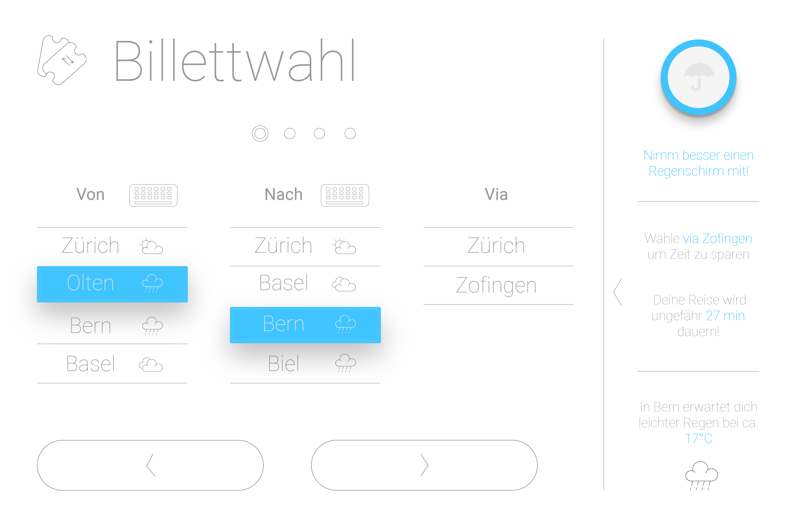
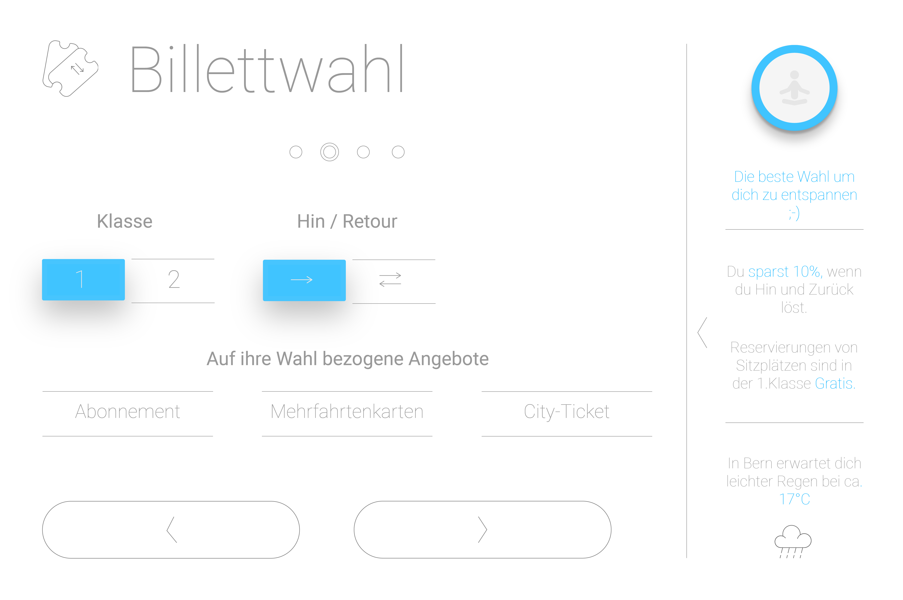
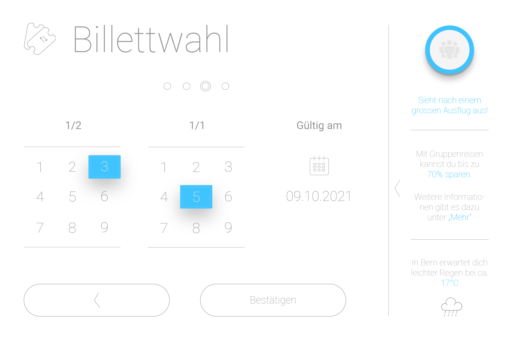
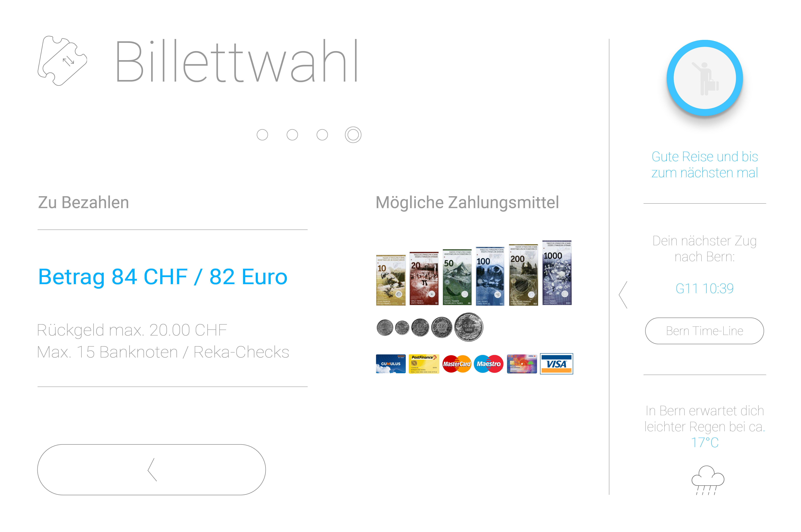

# Software Visual Design: Redesign SBB_Billetautomat

## Ziel
Als Abschlussarbeit der Berufsmaturität (IDPA) 2105, habe ich dem Billetautomat der SBB ein neues Design verpasst und mit einigen neuen Features ausgestattet. 

### Einzelne Screens
Starscreen

Time-Line

Billettewahl1

Billettewahl2

Billettewahl3

Billettewahl4

