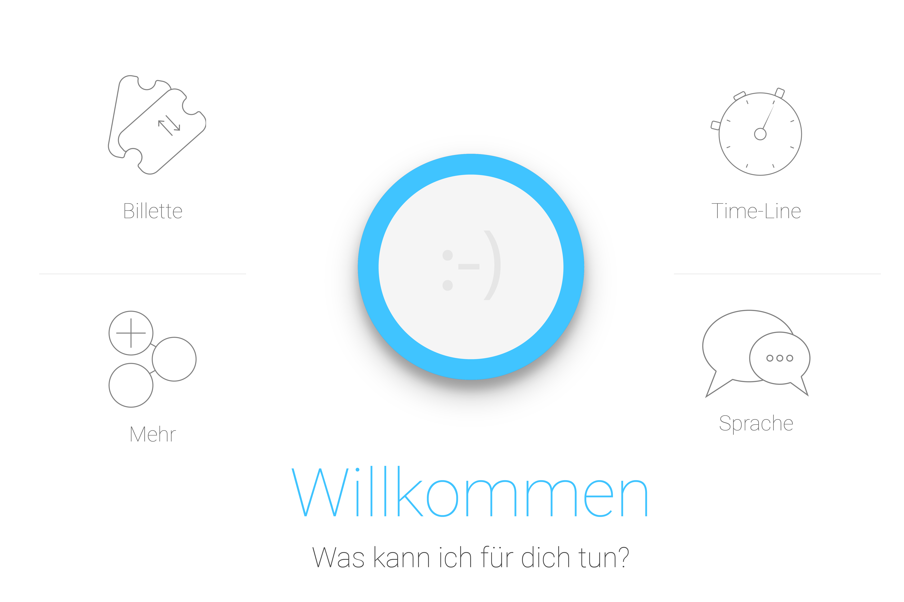
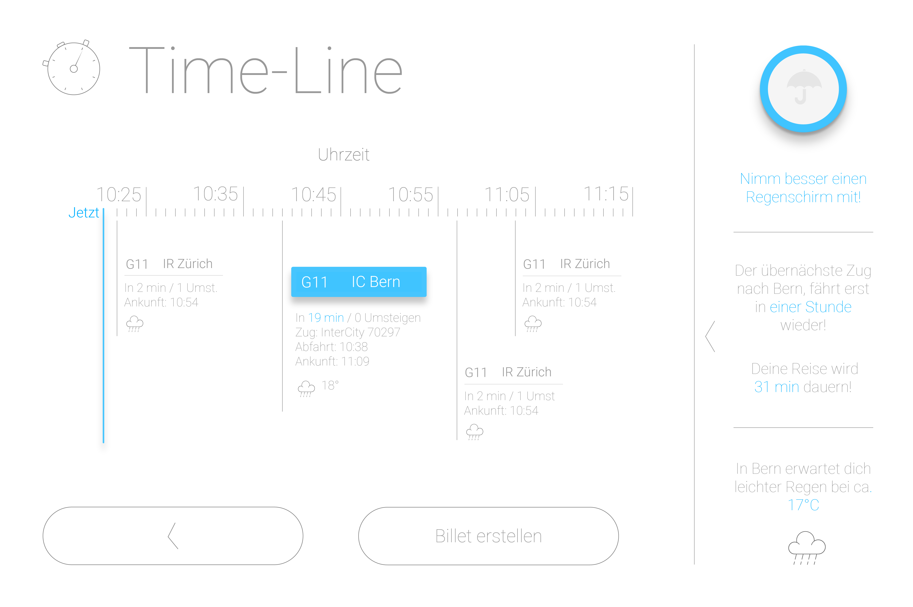
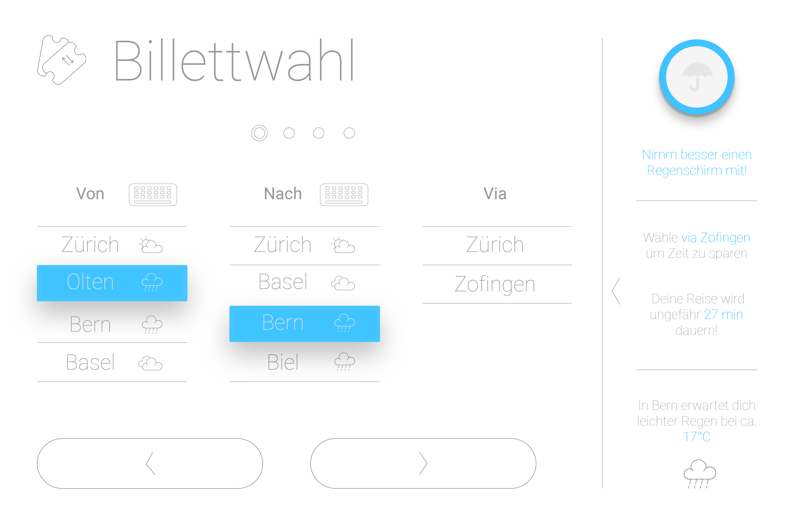
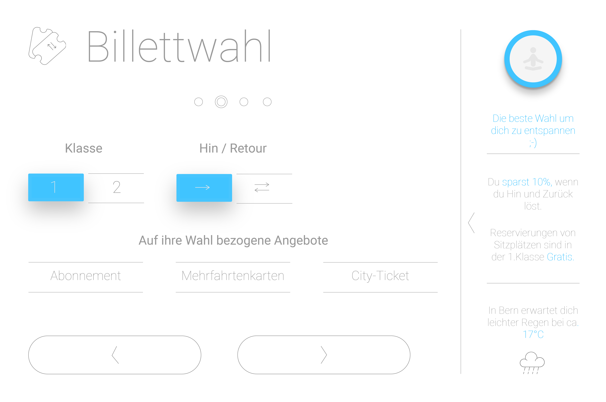
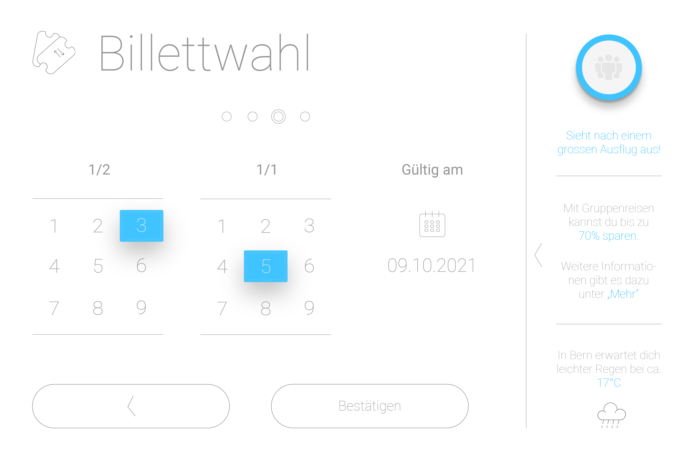

# App Design SBB_Billetautomat

## Ziel
Als Abschlussarbeit der Berufsmaturität (IDPA) , habe ich dem Billetautomat der SBB ein neues Design verpasst und mit einigen neuen Features ausgestattet. 

### Einzelne Screens

![Billettewahl4]Billettewahl Seite 4.png)

